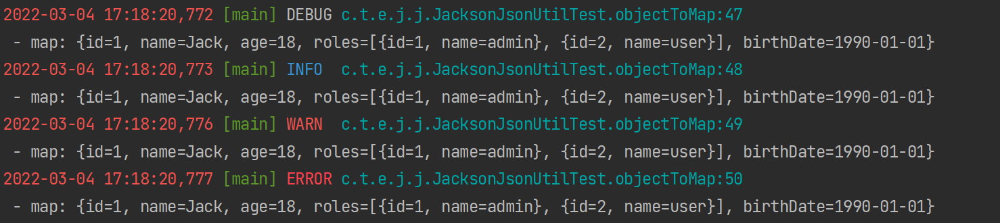

# Log4j2 Pattern Layout

## Patterns

### Name of the logger

**c**{precision} / **logger**{precision}

Outputs the name of the logger that published the logging event. The logger conversion specifier can be optionally followed by *precision specifier*, which consists of a decimal integer, or a pattern starting with a decimal integer.

| Conversion Pattern | Logger Name                 | Result                 |
| :----------------- | :-------------------------- | :--------------------- |
| %c{1}              | org.apache.commons.Foo      | Foo                    |
| %c{2}              | org.apache.commons.Foo      | commons.Foo            |
| %c{10}             | org.apache.commons.Foo      | org.apache.commons.Foo |
| %c{-1}             | org.apache.commons.Foo      | apache.commons.Foo     |
| %c{-2}             | org.apache.commons.Foo      | commons.Foo            |
| %c{-10}            | org.apache.commons.Foo      | org.apache.commons.Foo |
| %c{1.}             | org.apache.commons.Foo      | o.a.c.Foo              |
| %c{1.1.~.~}        | org.apache.commons.test.Foo | o.a.~.~.Foo            |
| %c{.}              | org.apache.commons.test.Foo | ....Foo                |

For example, `%c{1.}`

```
c.t.e.j.j.JacksonJsonUtilTest
```

### Source Code Info

**C**{precision} / **class**{precision}

Outputs the fully qualified class name of the caller issuing the logging request.

For example, `%C{1.}`

```
c.t.e.j.j.JacksonJsonUtilTest
```

**l **/ **location**

Outputs location information of the caller which generated the logging event.

For example, `%l`

```
com.taogen.example.jsonparser.jackson.JacksonJsonUtilTest.objectToMap(JacksonJsonUtilTest.java:47)
```

**L** / **line**

Outputs the line number from where the logging request was issued.

For example, `%L`

```
47
```

**M** / **method**

Outputs the method name where the logging request was issued.

For example, `%M`

```
objectToMap
```

### Datetime

**d**{pattern}/**date**{pattern}

Outputs the date of the logging event. The date conversion specifier may be followed by a set of braces containing a date and time pattern string per [SimpleDateFormat](https://docs.oracle.com/javase/6/docs/api/java/text/SimpleDateFormat.html).

```
2022-03-04 14:16:36,611
```

### Colors 

**highlight**{pattern}{style}

Adds ANSI colors to the result of the enclosed pattern based on the current event's logging level. (See Jansi [configuration](https://logging.apache.org/log4j/2.x/manual/layouts.html#enable-jansi).)

The default colors for each level are:

| Level | ANSI color              |
| :---- | :---------------------- |
| FATAL | Bright red              |
| ERROR | Bright red              |
| WARN  | Yellow                  |
| INFO  | Green                   |
| DEBUG | Cyan                    |
| TRACE | Black (looks dark grey) |

You can use the default colors with:

```
%highlight{%d [%t] %-5level: %msg%n%throwable}
```

You can override the default colors in the optional {style} option. For example:

```
%highlight{%d [%t] %-5level: %msg%n%throwable}{FATAL=white, ERROR=red, WARN=blue, INFO=black, DEBUG=green, TRACE=blue}
```

You can highlight only the a portion of the log event:

```
%d [%t] %highlight{%-5level: %msg%n%throwable}
```

You can style one part of the message and highlight the rest the log event:

```
%style{%d [%t]}{black} %highlight{%-5level: %msg%n%throwable}
```

You can also use the STYLE key to use a predefined group of colors:

```
%highlight{%d [%t] %-5level: %msg%n%throwable}{STYLE=Logback}
```

### Levels

**p**|**level**{*level*=*label*, *level*=*label*, ...} / **p**|**level**{length=*n*} / **p**|**level**{lowerCase=*true*|*false*}

Outputs the level of the logging event. 

### Processes and Threads

**pid**{[defaultValue]} / **processId**{[defaultValue]}

Outputs the process ID if supported by the underlying platform. An optional default value may be specified to be shown if the platform does not support process IDs.

**T** / **tid** / **threadId**

Outputs the ID of the thread that generated the logging event.

**t** / **tn** / **thread** / **threadName**

Outputs the name of the thread that generated the logging event.

## Pattern Examples

Basic

```xml
<Property name="my_pattern">%d [%t] %-5level %logger{36}:%L - %msg%n</Property>
```

Colorful

```xml
<Property name="my_pattern">%style{%d}{red} %style{[%t]}{Green} %highlight{%-5level}{STYLE=Logback} %style{%c{1.}.%M:%L}{cyan}\n - %msg%n</Property>
```



## References

[Layout Pattern](https://logging.apache.org/log4j/2.x/manual/layouts.html#PatternLayout)